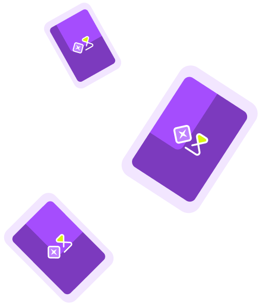
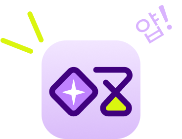
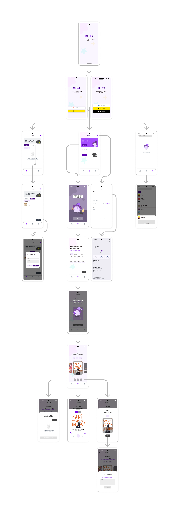

     
     

</img>    

  <table border="0" cellspacing="0" cellpadding="0" style="border: 1px solid white;">
    <tr>
      <td align="center" style="font-size: 25px; font-weight: bold; border: 1px solid white;">
        "우리가 당신만의  신비로운 음악을 찾아줄게"
      </td>
      <td style="border: 1px solid white;">
        
      </td>
    </tr>
  </table>

      

</img>
     

</img>
     

</img>
     

## 프로젝트 개요
### “MUOZ" 는 새로운 음악을 만나고 싶은 사람들을 위한 음악 추천형 오디오 플레이어입니다.
#### 'MUOZ'는 다음과 같은 분들을 위해 탄생되었습니다.

> 
 취향에 맞는 새로운 음악을 추천받아 보고 싶으신 분들

> 

> 
 현재 상황에 어울리는 음악을 찾고 있으신 분들

> 

> 
 여러 음악 카드를 플레이리스트로 가지고 싶으신 분들

> 

핵심 기술, 기능(젤위로) 상세하게 적기
각페이지별 기능
연결된 기술들

### ⏱️ 프로젝트 기간
`2025. 1. 16 - 진행중`

### 👥 개발 멤버

| **황상진** | **권유진** | **차부곤** | **홍의정** | **나영은** |
| :------: |  :------: | :------: | :------: | :------: |
| TL | SL | M | M | Designer |

### 👨‍👩‍👧‍👦 역할 분담
**황상진** : AI 음악 추천 / 오디오 플레이어 

**권유진** : 로그인 / 앱 설정

**차부곤** : 음악 검색 / Spotify / ManiaDB

**홍의정** : 음악 보관함 / DB / 플레이리스트

**나영은** : UX / UI 디자인

</img>

### 🛠️ 기술 스택
| 분류 | 이름 |
| --- | --- |
| Firebase |  
| 활용API |        |

## 💡 어떻게 사용하나요?

|  |  |  |
| ------------------------------------------------------------------------------------------------------ | ---------------------------------------------------------------------------------------------------------- | ---------------------------------------------------------------------------------------------------- |

### 🛡 소셜로그인 (google, kakao, apple)

> * firebase auth와 flutter package를 이용해서 google, apple 로그인 구현      
> * kakao 로그인은 firebase auth와 functions를 이용해서 구현         

미리보기

  
  

### 🚀  Google Gemini를 이용한 음악 추천 기능
 
> * 현재 상태, 상황, 음악장르, 선호 아티스트 등의 태그들을 활용하여 Gemini에게 음악 추천을 받습니다.
> * 추천받은 음악은 SPOTIFY 를 통해 검색 후, 음악 카드로써 가공되서 사용자에게 보여집니다.
> * 각 음악카드들은 보관함이나 플레이리스트에 저장할 수 있습니다.

미리보기

  
  
  
  
  

### 🔊 음악 재생 (오디오 플레이어)
 
> * 음악카드에 저장된 곡들을 재생합니다.
> * 재생되는 음원은 Youtube Explode 를 통해 제공됩니다.
> * 10초 건너뛰기, 위치 건너뛰기 등의 기능들을 제공합니다.

미리보기

  
  

### 📝 음악 보관함 (플레이리스트)

> * 수정중

미리보기

  
  

### 🔍 검색 기능 (제목 검색, 가사 검색)

> * Spotify web Api를 사용한 제목 검색 기능
> * Naver 가사검색 기능을 사용한 가사 검색 기능

미리보기

  
  
  

## 🚨 Trouble Shooting

> 사용하려던 domain 변경 [notion>](https://teamsparta.notion.site/domain-17d2dc3ef51481dea802d9bf863319e0)
> IOS에서 구글로그인 강제 종료 [notion>](https://teamsparta.notion.site/IOS-6c3d12eafa614d3b9fb495f0039284fe)
> IOS에서 스트리밍되는 audioUrl의 길이가 다른 문제 [notion>](https://www.notion.so/IOS-audioUrl-5984d131058c46b28b4711a3d16fa5eb?pvs=23)
> Google Gemini의 추천곡 로직에서 할루시네이션(Hallucination) 이 발생했던 문제 [notion>](https://www.notion.so/teamsparta/Google-Gemini-Hallucination-aaf8d827afe242edb9d9e734d81d025b)

---
### 라이브러리

  
  

   

[flutter_card_swiper](https://pub.dev/packages/flutter_card_swiper)       
[animated_toggle_switch](https://pub.dev/packages/animated_toggle_switch)      
[auto_animated](https://pub.dev/packages/auto_animated)     
[auto_size_text](https://pub.dev/packages/auto_size_text)             
[url_launcher](https://pub.dev/packages/url_launcher)                            
[youtube_explode_dart](https://pub.dev/packages/youtube_explode_dart)     
[google_sign_in](https://pub.dev/packages/google_sign_in)     
[firebase_auth](https://pub.dev/packages/firebase_auth)     
[cloud_firestore](https://pub.dev/packages/cloud_firestore)     
[google_generative_ai](https://pub.dev/packages/google_generative_ai)    
[just_audio](https://pub.dev/packages/just_audio)    
[audio_video_progress_bar](https://pub.dev/packages/audio_video_progress_bar)    
[sign_in_with_apple](https://pub.dev/packages/sign_in_with_apple)    
[http](https://pub.dev/packages/http)    
[xml2json](https://pub.dev/packages/xml2json)    
[html](https://pub.dev/packages/html)    
[toggle_switch](https://pub.dev/packages/toggle_switch)     
[auto_size_text](https://pub.dev/packages/auto_size_text)    
[cupertino_icons](https://pub.dev/packages/cupertino_icons)    
[go_router](https://pub.dev/packages/go_router)     
[flutter_riverpod](https://pub.dev/packages/flutter_riverpod)    
[firebase_core](https://pub.dev/packages/firebase_core)      
[flutter_dotenv](https://pub.dev/packages/flutter_dotenv)       
[lottie](https://pub.dev/packages/lottie)        
[package_info_plus](https://pub.dev/packages/package_info_plus)        
[shared_preferences](https://pub.dev/packages/shared_preferences)       
[android_intent_plus](https://pub.dev/packages/android_intent_plus)       
[kakao_flutter_sdk](https://pub.dev/packages/kakao_flutter_sdk)      
[easy_rich_text](https://pub.dev/packages/easy_rich_text)      
[intl](https://pub.dev/packages/intl)        
[flutter_slidable](https://pub.dev/packages/flutter_slidable)        
[mockito](https://pub.dev/packages/mockito)        
[build_runner](https://pub.dev/packages/build_runner)       
[flutter_lints](https://pub.dev/packages/flutter_lints)      
[change_app_package_name](https://pub.dev/packages/change_app_package_name)        
[mocktail](https://pub.dev/packages/mocktail)       

