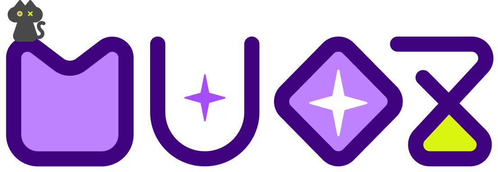
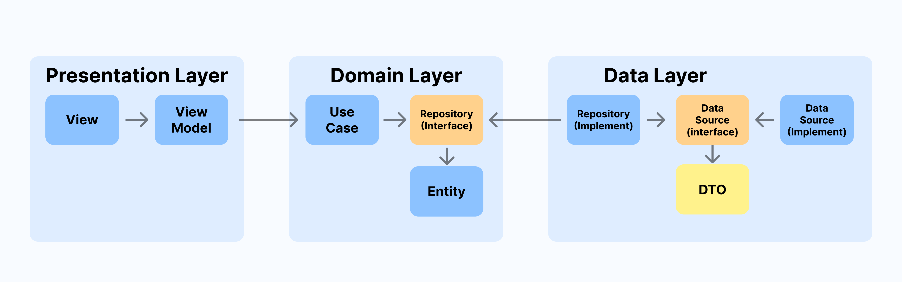
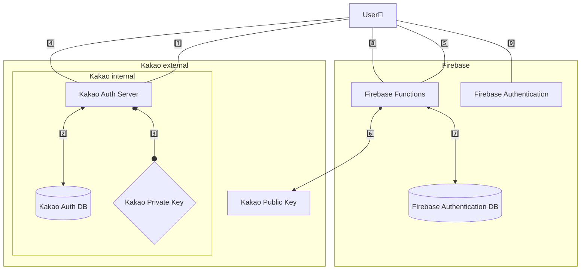

    
    

</img>
     

<!-- </img>     -->

  <table border="0" cellspacing="0" cellpadding="0" style="border: 1px solid white;">
    <tr>
      <td align="center" style="font-size: 25px; font-weight: bold; border: 1px solid white;">
        "우리가 당신만의  신비로운 음악을 찾아줄게"
      </td>
      <td style="border: 1px solid white;">
        
      </td>
    </tr>
  </table>

</img>
     

</img>
     

</img>
  

## ♒ 프로젝트 개요    
### 'MUOZ' 는 새로운 음악🎵을  🎶 만나고 싶은 사람들을 위한  음악 추천형🎵 오디오 플레이어입니다.

#### 'MUOZ'는 다음과 같은 분들을 위해  탄생되었습니다 !
</img>   

> 
 취향에 맞는 새로운 음악을 추천받아 보고 싶으신 분들

> 
 현재 상황에 어울리는 음악을 찾고 있으신 분들

> 
 여러 음악 카드를 플레이리스트로 가지고 싶으신 분들
     

&nbsp;

### ⏱️ 프로젝트 기간

`2025. 1. 16 - 진행중`     

&nbsp;

### 💟 개발 멤버

| **황상진** | **권유진** | **차부곤** | **홍의정** | **나영은** |
| :--------: | :--------: | :--------: | :--------: | :--------: |
|     [@Hamiric](https://github.com/Hamiric)     |     [@UooUzzz](https://github.com/UooUzzz)    |     [@Dev-Combu](https://github.com/Dev-Combu)     |     [@marion419](https://github.com/marion419)      |   |
|     TL     |     SL     |     M      |     M      |  Designer  |       

##### [💜 프로젝트 노션으로!](https://www.notion.so/teamsparta/MuOz-9fb16264f6db47e8b810e86e0a7828b7)     
##### [💜 프로젝트 깃허브로!](https://github.com/Oz-player/oz_player)        

&nbsp;
### 💟 역할 분담    
| </img> |       
| ------------- |        

&nbsp;

### 👾 기술 스택

| 분류     | 이름                                                                                                                                                                                                                                                                                                                                                                                                                                            |
| -------- | ----------------------------------------------------------------------------------------------------------------------------------------------------------------------------------------------------------------------------------------------------------------------------------------------------------------------------------------------------------------------------------------------------------------------------------------------- |
| Firebase |                                                                                                                                                                                                                                                                                                                          |
| 활용API  |        |        

&nbsp;

### 🍇 코드 구조    
#### ➡ 클린 아키텍처(Clean Architecture)
| </img> |       
| ------------- |        

> <strong>🏗 선택한 이유 </strong>    
관심사를 분리함으로써 보일러플레이트 코드를 줄이고  코드의 유지보수성과 확장성을 높이는 것이  클린 아키텍처를 선택한 주된 이유입니다.      

&nbsp;

## ♒ MuOz 기능

| </img> |       
| ------------- |        

&nbsp;
### 🟣 소셜로그인 (google, kakao, apple) 

> - 세 가지 종류의 소설 로그인 기능을 지원합니다.
> - kakao 로그인 : firebase의 functions 기능을 이용해서 구현하였습니다.
> - google, apple 로그인 : firebase auth와 flutter package를 이용해서 구현하였습니다.     

  ⬇ Kakao 로그인(Functions) 동작 흐름

미리보기

  
  

    
&nbsp;

### 🟣 Google Gemini를 이용한 음악 추천 기능 

> - 현재 상태, 상황, 음악장르, 선호 아티스트 등의 태그들을 활용하여 Google Gemini에게 음악 추천을 받습니다.
> - 음악을 추천받아 SPOTIFY API를 거쳐 데이터를 정제한 후, 사용자에게 카드 형태 UI를 제공합니다.
> - 원하는 음악 카드에 메모를 붙여 라이브러리에 저장할 수 있습니다.
> - 마음에 드는 곡을 플레이리스트에 저장할 수 있습니다.

미리보기

  
  
  
  
  

     

&nbsp;
### 🟣 음악 재생 (오디오 플레이어) 

> - YouTube를 활용하여 플레이리스트에서 선택한 곡을 재생합니다.
> - 10초 건너뛰기, 타임라인 선택 등의 기능을 제공합니다.

미리보기

     

  
  

     
     
&nbsp;
### 🟣 음악 보관함 (플레이리스트) 

> - 지금까지 저장한 음악 카드를 살펴볼 수 있습니다.
> - 플레이리스트를 생성하거나 저장한 플레이리스트를 열람, 재생합니다.
> - 플레이리스트를 편집할 수 있습니다. 곡을 당겨 순서를 바꾸거나 왼쪽으로 밀어 삭제해보세요.

미리보기

  
  
  

       
&nbsp;

### 🟣 검색 기능 (제목 검색, 가사 검색) 

> - Spotify web Api를 사용하여 음악 제목을 겁색합니다.
> - Naver 가사검색 기능을 사용하여 검색어에 해당하는 가사를 포함하는 곡을 보여줍니다.

미리보기

  
  
  

     

&nbsp;

## ♒ 모니터링 방법    
| </img> |       
| ------------- |         

> <strong>📊 선택한 이유 </strong>   
Firebase Crashlytics는 로그를 일정 시간 단위로 묶어 전송하는 반면,  [Sentry](https://sentry.io/welcome/)는 릴리즈 모드에서 실시간으로 오류를 추적하기 용이합니다.  현재 서비스의 초기 단계에서 다양한 버그가 발생할 가능성이 높다고 판단하여,  보다 신속한 디버깅이 가능한 [Sentry](https://sentry.io/welcome/)를 선택했습니다.

&nbsp;

## ♒ Trouble Shooting

> ✔ 사용하려던 domain 변경 [notion>](https://teamsparta.notion.site/domain-17d2dc3ef51481dea802d9bf863319e0)  
> ✔ IOS에서 구글로그인 강제 종료 [notion>](https://teamsparta.notion.site/IOS-6c3d12eafa614d3b9fb495f0039284fe)  
> ✔ IOS에서 스트리밍되는 audioUrl의 길이가 다른 문제 [notion>](https://www.notion.so/IOS-audioUrl-5984d131058c46b28b4711a3d16fa5eb?pvs=23)  
> ✔ Google Gemini의 추천곡 로직에서 할루시네이션(Hallucination) 이 발생했던 문제 [notion>](https://www.notion.so/teamsparta/Google-Gemini-Hallucination-aaf8d827afe242edb9d9e734d81d025b)     
> ✔ go router 파라미터 문제 [notion>](https://www.notion.so/teamsparta/go-router-497180bd5ebc474b80f7cc114a8a3039)     

&nbsp;
&nbsp;

  

---

### 라이브러리

  
  

 

[flutter_card_swiper](https://pub.dev/packages/flutter_card_swiper)  
[animated_toggle_switch](https://pub.dev/packages/animated_toggle_switch)  
[auto_animated](https://pub.dev/packages/auto_animated)  
[auto_size_text](https://pub.dev/packages/auto_size_text)  
[url_launcher](https://pub.dev/packages/url_launcher)  
[youtube_explode_dart](https://pub.dev/packages/youtube_explode_dart)  
[google_sign_in](https://pub.dev/packages/google_sign_in)  
[firebase_auth](https://pub.dev/packages/firebase_auth)  
[cloud_firestore](https://pub.dev/packages/cloud_firestore)  
[google_generative_ai](https://pub.dev/packages/google_generative_ai)  
[just_audio](https://pub.dev/packages/just_audio)  
[audio_video_progress_bar](https://pub.dev/packages/audio_video_progress_bar)  
[sign_in_with_apple](https://pub.dev/packages/sign_in_with_apple)  
[http](https://pub.dev/packages/http)  
[xml2json](https://pub.dev/packages/xml2json)  
[html](https://pub.dev/packages/html)  
[toggle_switch](https://pub.dev/packages/toggle_switch)  
[auto_size_text](https://pub.dev/packages/auto_size_text)  
[cupertino_icons](https://pub.dev/packages/cupertino_icons)  
[go_router](https://pub.dev/packages/go_router)  
[flutter_riverpod](https://pub.dev/packages/flutter_riverpod)  
[firebase_core](https://pub.dev/packages/firebase_core)  
[flutter_dotenv](https://pub.dev/packages/flutter_dotenv)  
[lottie](https://pub.dev/packages/lottie)  
[package_info_plus](https://pub.dev/packages/package_info_plus)  
[shared_preferences](https://pub.dev/packages/shared_preferences)    
[android_intent_plus](https://pub.dev/packages/android_intent_plus)    
[kakao_flutter_sdk](https://pub.dev/packages/kakao_flutter_sdk)    
[easy_rich_text](https://pub.dev/packages/easy_rich_text)     
[intl](https://pub.dev/packages/intl)    
[flutter_slidable](https://pub.dev/packages/flutter_slidable)    
[mockito](https://pub.dev/packages/mockito)     
[build_runner](https://pub.dev/packages/build_runner)    
[flutter_lints](https://pub.dev/packages/flutter_lints)     
[change_app_package_name](https://pub.dev/packages/change_app_package_name)    
[mocktail](https://pub.dev/packages/mocktail)     
[easy_debounce](https://pub.dev/packages/easy_debounce)     
[flutter_svg](https://pub.dev/packages/flutter_svg)     
[sentry_flutter](https://pub.dev/packages/sentry_flutter)     
[flutter_secure_storage](https://pub.dev/packages/flutter_secure_storage)     
[flutter_styled_toast](https://pub.dev/packages/flutter_styled_toast)      

