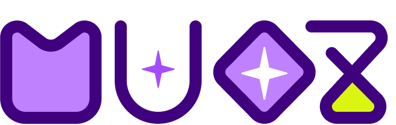

</img>

##### 
<h1>😈 STACKS </h1>

    
    
     
 
    
    
 
 

## 프로젝트 개요
### “MUOZ" 는 새로운 음악을 만나고 싶은 사람들을 위한 음악 추천형 오디오 플레이어입니다.
#### 'MUOZ'는 다음과 같은 분들을 위해 탄생되었습니다.

> 💚 취향에 맞는 새로운 음악을 추천받아 보고 싶으신 분들
> 

> 🌟 현재 상황에 어울리는 음악을 찾고 있으신 분들
> 

> 🏞 여러 음악 카드를 플레이리스트로 가지고 싶으신 분들
> 

라이브러리(맨아래)
핵심 기술, 기능(젤위로) 상세하게 적기
각페이지별 기능
팀원들 기능
이슈들
개발 기간
트러블슈팅[페이지 따로만들어서 링크]
연결된 기술들

---
### 라이브러리

 

[flutter_card_swiper | Flutter package](https://pub.dev/packages/flutter_card_swiper)
[flutter_slider_drawer | Flutter package](https://pub.dev/packages/flutter_slider_drawer)
[audio_service | Flutter package](https://pub.dev/packages/audio_service)
[loading_indicator | Flutter package](https://pub.dev/packages/loading_indicator)
[animated_toggle_switch | Flutter package](https://pub.dev/packages/animated_toggle_switch)
[auto_animated | Flutter package](https://pub.dev/packages/auto_animated)
[auto_size_text | Flutter package](https://pub.dev/packages/auto_size_text)
[flutter_native_splash | Flutter package](https://pub.dev/packages/flutter_native_splash)
[circular_reveal_animation | Flutter package](https://pub.dev/packages/circular_reveal_animation)
[badges | Flutter package](https://pub.dev/packages/badges)
[flutter_styled_toast | Flutter package](https://pub.dev/packages/flutter_styled_toast)
[drop_down_list | Flutter package](https://pub.dev/packages/drop_down_list)
[url_launcher | Flutter package](https://pub.dev/packages/url_launcher)
[animate_do | Flutter package](https://pub.dev/packages/animate_do)
[chewie | Flutter package](https://pub.dev/packages/chewie)
[expandable_page_view | Flutter package](https://pub.dev/packages/expandable_page_view)
[in_app_update | Flutter package](https://pub.dev/packages/in_app_update)
[tab_container | Flutter package](https://pub.dev/packages/tab_container)
[floating | Flutter package](https://pub.dev/packages/floating)
[flutter_gen_runner | Dart package](https://pub.dev/packages/flutter_gen_runner)
[flutter_adaptive_scaffold | Flutter package](https://pub.dev/packages/flutter_adaptive_scaffold)
[spotify_sdk example | Flutter package](https://pub.dev/packages/spotify_sdk/example)
[spotify | Dart package](https://pub.dev/packages/spotify)
[realm | Flutter package](https://pub.dev/packages/realm)
[youtube_player_flutter | Flutter package](https://pub.dev/packages/youtube_player_flutter)
[youtube_explode_dart | Dart package](https://pub.dev/packages/youtube_explode_dart)
[google_sign_in | Flutter package](https://pub.dev/packages/google_sign_in)
[firebase_auth | Flutter package](https://pub.dev/packages/firebase_auth)
[cloud_firestore | Flutter package](https://pub.dev/packages/cloud_firestore)
[google_generative_ai | Dart package](https://pub.dev/packages/google_generative_ai)
[just_audio | Flutter package](https://pub.dev/packages/just_audio)
[audio_video_progress_bar | Flutter package](https://pub.dev/packages/audio_video_progress_bar)
[sign_in_with_apple | Flutter package](https://pub.dev/packages/sign_in_with_apple)
[http | Dart package](https://pub.dev/packages/http)
[xml2json | Dart package](https://pub.dev/packages/xml2json)
[html | Dart package](https://pub.dev/packages/html)
[toggle_switch | Flutter package](https://pub.dev/packages/toggle_switch)
[auto_size_text | Flutter package](https://pub.dev/packages/auto_size_text)
[cupertino_icons | Dart package](https://pub.dev/packages/cupertino_icons)
[go_router | Flutter package](https://pub.dev/packages/go_router)
[flutter_riverpod | Flutter package](https://pub.dev/packages/flutter_riverpod)
[firebase_core | Flutter package](https://pub.dev/packages/firebase_core)

### ⏱️ 프로젝트 기간
`2025. 1. 16 - 진행중`

### 👥 개발 멤버

| **황상진** | **권유진** | **차부곤** | **홍의정** | **나영은** |
| :------: |  :------: | :------: | :------: | :------: |
| TL | SL | M | M | Designer |

### 👨‍👩‍👧‍👦 역할 분담
**황상진** : AI 음악 추천 / 오디오 플레이어 

**권유진** : 로그인 / 앱 설정

**차부곤** : 음악 검색 / Spotify / ManiaDB

**홍의정** : 음악 보관함 / DB / 플레이리스트

**나영은** : UX / UI 디자인

### 🛠️ 기술 스택
| 분류 | 이름 |
| --- | --- |
| Firebase |  
| 활용API |        |

## 💡 어떻게 사용하나요?

|  |  |  |
| ------------------------------------------------------------------------------------------------------ | ---------------------------------------------------------------------------------------------------------- | ---------------------------------------------------------------------------------------------------- |

### 🛡 소셜로그인 (google, kakao, apple)

> * 수정중

미리보기

> 

 

### 🚀  Google Gemini를 이용한 음악 추천 기능
 
> * 수정중

미리보기

  

### 🔊 음악 재생 (오디오 플레이어)
 
> * 수정중

미리보기

  

### 📝 음악 보관함 (플레이리스트)

> * 수정중

미리보기

 

 

### 🔍 검색 기능 (제목 검색, 가사 검색)

> * 수정중

미리보기

  

## 🚨 Trouble Shooting

> 추가 예정